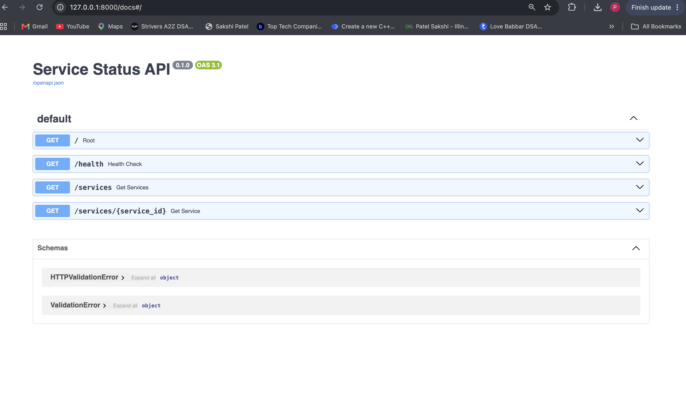
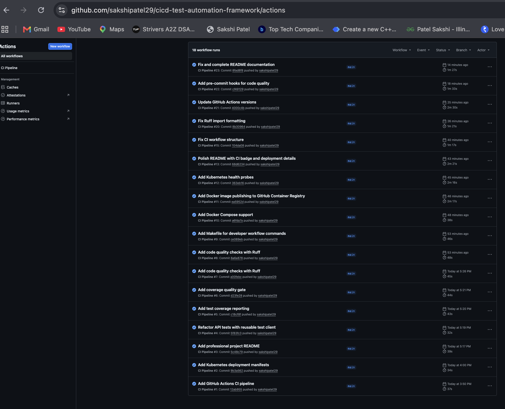
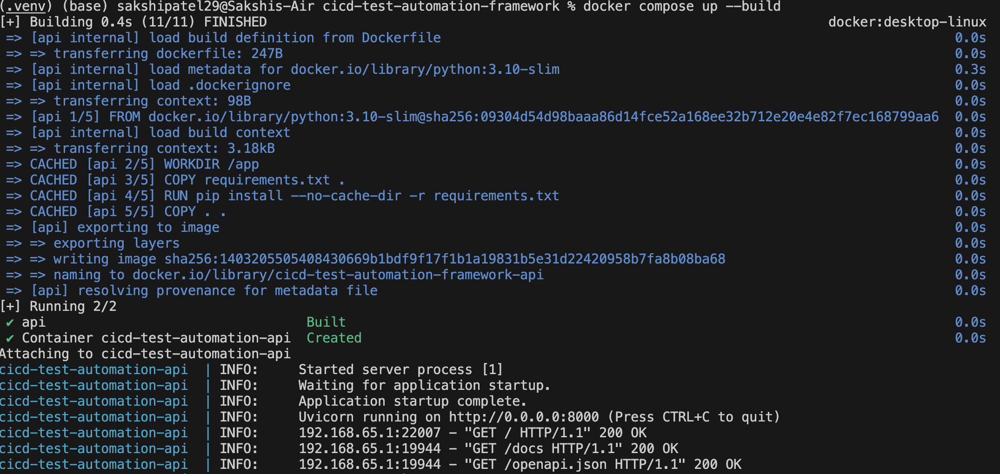
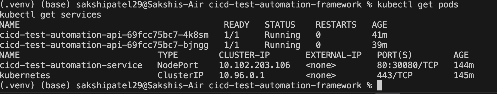

# CI/CD Pipeline & Test Automation Framework


A cloud-native CI/CD and test automation project built for a Python FastAPI microservice. The project demonstrates automated testing, code quality validation, Docker containerization, Kubernetes deployment, GitHub Actions CI/CD workflows, Docker smoke testing, and container image publishing to GitHub Container Registry.

## Project Overview

This project simulates a real-world microservices deployment workflow. It includes a FastAPI service with multiple endpoints, automated API tests, Docker support, Docker Compose, Kubernetes manifests, pre-commit hooks, and a GitHub Actions CI pipeline that validates code changes before deployment.

## Documentation

* [Architecture Documentation](docs/architecture.md)
* [Kubernetes Deployment Guide](k8s/README.md)

## Demo Screenshots

### FastAPI Swagger Documentation



### GitHub Actions CI Pipeline



### Dockerized Application Running



### Kubernetes Deployment Running



## Tech Stack

* Python
* FastAPI
* Pytest
* Pytest-Cov
* Ruff
* Pre-commit
* Docker
* Docker Compose
* Kubernetes
* GitHub Actions
* GitHub Container Registry
* Uvicorn

## Features

* Built a FastAPI-based microservice for service health and status monitoring.
* Implemented automated API tests using Pytest and FastAPI TestClient.
* Added reusable Pytest fixtures for cleaner test automation.
* Added test coverage reporting with an 80% minimum coverage gate.
* Added Ruff for code quality checks and formatting.
* Added pre-commit hooks to catch issues before code is committed.
* Containerized the application using Docker.
* Added Docker Compose support for simplified local container execution.
* Added Kubernetes deployment and service manifests.
* Added Kubernetes readiness and liveness probes.
* Configured GitHub Actions to run tests, linting, coverage checks, Kubernetes manifest validation, Docker builds, Docker smoke tests, and image publishing.
* Published the Docker image to GitHub Container Registry.

## CI/CD Capabilities

This project includes a production-style CI/CD workflow using GitHub Actions.

The pipeline performs:

* Dependency installation
* Code quality checks using Ruff
* Kubernetes manifest validation
* Automated API testing using Pytest
* Test coverage reporting
* Coverage quality gate enforcement
* Test and coverage report artifact upload
* Docker image build validation
* Docker container smoke testing
* Docker image publishing to GitHub Container Registry

The CI pipeline fails automatically if tests fail, linting fails, Kubernetes manifest validation fails, Docker build fails, smoke testing fails, or code coverage drops below the required threshold.

## Project Structure

```text
cicd-test-automation-framework/
├── app/
│   ├── __init__.py
│   └── main.py
├── tests/
│   ├── __init__.py
│   ├── conftest.py
│   ├── test_main.py
│   └── test_services.py
├── k8s/
│   ├── deployment.yaml
│   ├── service.yaml
│   └── README.md
├── docs/
│   └── architecture.md
├── scripts/
│   └── validate_k8s_manifests.py
├── .github/
│   └── workflows/
│       └── ci.yml
├── Dockerfile
├── docker-compose.yml
├── Makefile
├── .dockerignore
├── .gitignore
├── .pre-commit-config.yaml
├── pyproject.toml
├── pytest.ini
├── requirements.txt
└── README.md
```

## API Endpoints

| Method | Endpoint                 | Description                           |
| ------ | ------------------------ | ------------------------------------- |
| GET    | `/`                      | Root API message                      |
| GET    | `/health`                | Health check endpoint                 |
| GET    | `/services`              | Returns all service statuses          |
| GET    | `/services/{service_id}` | Returns status for a specific service |

## Run Locally

Create and activate a virtual environment:

```bash
python3 -m venv .venv
source .venv/bin/activate
```

Install dependencies:

```bash
pip install -r requirements.txt
```

Run the application:

```bash
python -m uvicorn app.main:app --reload
```

Open the API:

```text
http://127.0.0.1:8000
```

Open Swagger documentation:

```text
http://127.0.0.1:8000/docs
```

## Run Tests

```bash
python -m pytest
```

Expected result:

```text
5 passed
```

## Code Quality Checks

Run Ruff:

```bash
ruff check .
```

Run pre-commit checks:

```bash
pre-commit run --all-files
```

## Docker Usage

Build the Docker image:

```bash
docker build -t cicd-test-automation-api .
```

Run the Docker container:

```bash
docker run -p 8000:8000 cicd-test-automation-api
```

Open:

```text
http://127.0.0.1:8000
```

## Docker Compose Usage

Run the application using Docker Compose:

```bash
docker compose up --build
```

Open:

```text
http://127.0.0.1:8000
```

Stop the container:

```bash
docker compose down
```

## Kubernetes Deployment

Apply Kubernetes manifests:

```bash
kubectl apply -f k8s/deployment.yaml
kubectl apply -f k8s/service.yaml
```

Check resources:

```bash
kubectl get pods
kubectl get deployments
kubectl get services
```

Access the service locally:

```text
http://localhost:30080
```

## GitHub Actions CI Pipeline

The CI pipeline runs automatically on:

* Push to `main`
* Push to `feature/*`
* Pull request to `main`

Pipeline jobs:

1. Run automated tests
2. Run code quality checks
3. Validate Kubernetes manifests
4. Generate test and coverage reports
5. Build Docker image
6. Run Docker smoke tests
7. Publish Docker image to GitHub Container Registry

## Container Registry

The Docker image is automatically published to GitHub Container Registry when changes are pushed to the `main` branch.

Image:

```text
ghcr.io/sakshipatel29/cicd-test-automation-framework:latest
```

The Kubernetes deployment uses this published container image.

## Makefile Commands

Common developer commands:

```bash
make install
make run
make test
make lint
make format
make docker-build
make docker-run
make compose-up
make compose-down
make k8s-apply
make k8s-delete
```

## Resume Description

Designed and implemented a cloud-native CI/CD and test automation framework for a Python FastAPI microservice with automated API testing, Docker containerization, Kubernetes deployment, GitHub Actions workflows, code quality checks, coverage reporting, Docker smoke testing, and GitHub Container Registry publishing.

## Author

Sakshi Patel
